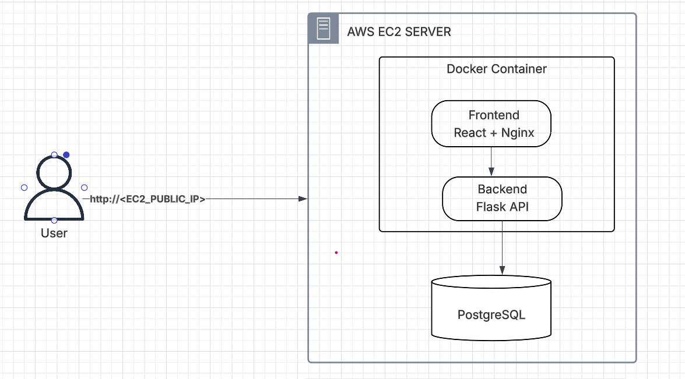

# Task Manager Microservices Project

## Overview

A complete DevOps project for a **Task Management System** built with microservices architecture using **React (frontend)** and **Flask (backend)**, with **PostgreSQL** as the database. The system is deployed on an **AWS EC2 instance** using **Docker Compose**, managed with **Ansible**, and fully automated using a **GitLab CI/CD pipeline**.

---

## Architecture



---

## 1. AWS EC2 Setup

* Launch a **t2.micro** Ubuntu EC2 instance (Free Tier).
* Configure **Security Groups**:

  * Allow SSH (port 22)
  * Allow HTTP (port 80)
  * Allow Backend/API (port 5000)
  * Allow PostgreSQL (port 5432) for internal testing

## 2. SSH Access Configuration

* Generate SSH keys locally (`ssh-keygen`)
* Add public key to EC2 server `~/.ssh/authorized_keys`
* Use the **private key in GitLab CI/CD variables**

---

## 3. Ansible Provisioning

A custom **Ansible playbook** automates EC2 server configuration:

* Installs Docker, Docker Compose
* Installs and configures PostgreSQL
* Configures PostgreSQL to allow external connections
* Creates DB and user `Admin` with access to `microservices_db`

Command:

```bash
ansible-playbook -i inventory.ini playbook.yml
```

---

## 4. Project Structure

```text
.
├── backend/
│   ├── app.py
│   ├── requirements.txt
│   ├── dockerfile
│   └── tests/
├── frontend/
│   ├── src/
│   ├── public/
│   ├── Dockerfile
│   └── package.json
├── docker-compose.yml
├── ansible/
│   ├── playbook.yml
│   └── inventory.ini
├── .gitlab-ci.yml
└── README.md
```

---

## 5. Docker Compose Configuration

File: `docker-compose.yml`

```yaml
services:
  backend:
    build:
      context: ./backend
      dockerfile: dockerfile
    ports:
      - "5000:5000"
    environment:
      - DATABASE_URL=postgresql://postgres:postgres@<EC2_PRIVATE_IP>:5432/microservices_db

  frontend:
    build:
      context: ./frontend
      dockerfile: Dockerfile
    ports:
      - "80:80"
    depends_on:
      - backend
```

---

## 6. GitLab CI/CD Pipeline Explanation

### ✅ `notify`

Sends a Slack message when the pipeline starts.

* **SLACK\_WEBHOOK**: Slack incoming webhook URL

### ✅ `install`

Installs frontend and backend dependencies.

* Frontend: `npm install`
* Backend: `pip install -r requirements.txt`

### ✅ `lint`

Runs static code analysis:

* Frontend: ESLint
* Backend: Flake8

### ✅ `test`

Runs unit tests:

* Frontend: `npm run test`
* Backend: `pytest`

### ✅ `build`

Builds Docker images using `docker buildx` for multi-arch.

* Saves them locally as `.tar` files for later deployment.
* Outputs:

  * `frontend.tar`
  * `backend.tar`

### ✅ `scan`

Uses **Trivy** to scan built Docker images:

* Loads previously saved images
* Outputs:

  * `trivy-frontend-report.txt`
  * `trivy-backend-report.txt`

### ✅ `deploy`

* Connects to EC2 via SSH
* Uploads Docker images + `docker-compose.yml`
* Loads images using `docker load`
* Runs services using:

  ```bash
  docker compose up -d --no-build
  ```

---

## 7. Deployment URL

```
http://<EC2_PUBLIC_IP>
```

---

## 8. Security Scan Results

### ✅ Backend

```
Clean (no security findings detected)
```

### ✅ Frontend

```
Clean (no security findings detected)
```

---

## 9. How to Run the System

### Step 1: Clone the Repository

```bash
git clone https://github.com/Mmohamedtarek/mid-project-DevOps.git
```

### Step 2: Set GitLab CI/CD Variables

Go to GitLab Project > **Settings > CI/CD > Variables** and define:

* `SSH_PRIVATE_KEY`: your private key to access EC2
* `EC2_HOST`: Public IP of the EC2 instance
* `EC2_USER`: Typically `ubuntu`
* `DOCKER_USERNAME`: DockerHub username
* `DOCKER_PASSWORD`: DockerHub password
* `SLACK_WEBHOOK`: (Optional) Slack webhook for notifications

### Step 3: Run the Pipeline

Push your changes or trigger pipeline manually from GitLab UI.

### Step 4: Access the Application

Frontend:

```
http://<EC2_PUBLIC_IP

http://13.53.134.102/
```


## Architected by:

**Mohamed Tarek**
DevOps Engineer 